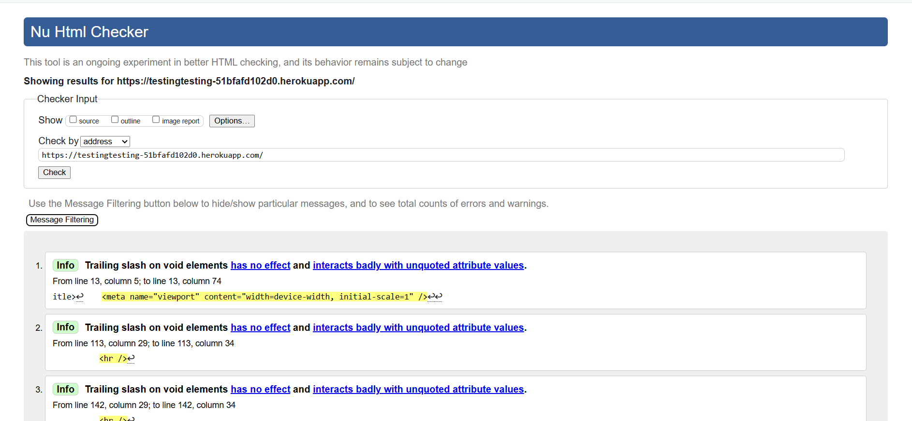
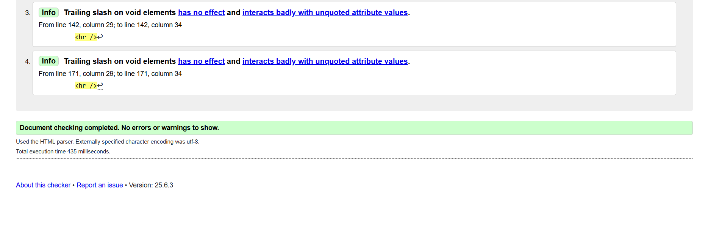
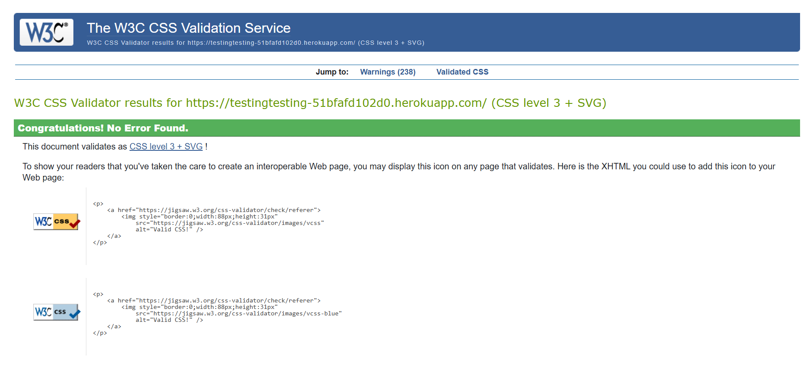

# Code Validation

## HTML Code Validation

- 
- 

## CSS Code Validation

- 

# Testing

## Overview
This project includes both automated and manual testing to ensure all user stories and acceptance criteria are met.

## Automated Tests
- **Framework**: Django's built-in testing framework
- **Location**: `tests.py` files in posts app
- **Coverage**: Models, views, forms, and URL routing

### Running Automated Tests
```bash
python manage.py test
```

### Test Coverage
- User authentication and registration
- Post creation, editing, and deletion
- Comment functionality and approval system
- URL routing and view responses

## Manual Testing

### User Story Testing
Each user story has been manually tested against its acceptance criteria:

#### 1. Open a Post
**User Story**: As a Site User, I can click on a post so that I can read the full text.
- **AC1**: When a blog post title is clicked on a detailed view of the post is seen.
- **Test Result**:  Pass - Clicking post title opens detailed view

#### 2. View Comments
**User Story**: As a Site User/Admin I can view comments on an individual post so that I can read the conversation.
- **AC1**: Given one or more user comments the admin can view them.
- **AC2**: Then a site user can click on the comment thread to read the conversation.
- **Test Result**:  Pass - Comments display correctly for both users and admins

#### 3. Account Registration
**User Story**: As a Site User I can register an account so that I can comment on a post.
- **AC1**: Given an email a user can register an account.
- **AC2**: Then the user can log in.
- **AC3**: When the user is logged in they can comment.
- **Test Result**:  Pass - Registration, login, and commenting workflow functions correctly

#### 4. Comment on a Post
**User Story**: As a Site User I can leave comments on a post so that I can be involved in the conversation.
- **AC1**: When a user comment is approved
- **AC2**: Then a user can reply
- **AC3**: Given more than one comment then there is a conversation thread
- **Test Result**:  Pass - Comment approval and threading system works

#### 5. Modify or Delete Comment 
**User Story**: As a Site User I can modify or delete my comment on a post so that I can be involved in the conversation.
- **AC1**: Given a logged in user, they can modify their comment
- **AC2**: Given a logged in user, they can delete their comment
- **Test Result**:  Pass - Users can edit and delete their own comments

#### 6. Manage Posts
**User Story**: As a Site Admin I can create, read, update and delete posts so that I can manage my blog content.
- **AC1-4**: Create, read, update, delete functionality for admin users
- **Test Result**:  Pass - All CRUD operations work correctly

#### 7. Create Drafts
**User Story**: As a Site Admin I can create draft posts so that I can finish writing the content later.
- **AC1**: Admin can save draft posts
- **AC2**: Can finish content later
- **Test Result**:  Pass - Draft system functions correctly

#### 8. Approve Comments
**User Story**: As a Site Admin I can approve or disapprove comments so that I can filter out objectionable comments.
- **AC1**: Admin can approve comments
- **AC2**: Admin can disapprove comments
- **Test Result**:  Pass - Comment moderation works

## Responsive Testing
Tested on various screen sizes:
- Mobile (320px-768px)
- Tablet (768px-1024px)
- Desktop (1024px+)

## Functionality Testing
- All CRUD operations work correctly
- User authentication and permissions function properly
- Data validation prevents invalid submissions
- Application is responsive across different devices